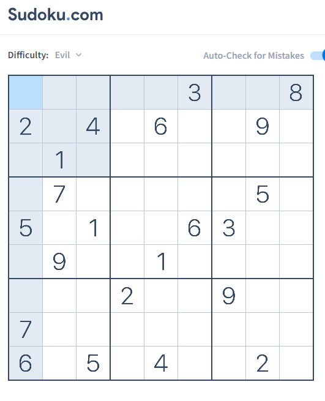

# Sudoku_Solver
In solver.py we have to pass the sudoku value as multi dimensional list.</br>
# pyautogui
PyAutoGUI lets your Python scripts control the mouse and keyboard to automate interactions with other applications. </br>
To install this module do:</br>
```pip install pyautogui```
</br> After running the program input rows of sudoku one by one as following</br>
```
Row: 780400120
Row 1 Complete
Row: 600075009
Row 2 Complete
Row: 000601078
Row 3 Complete
Row: 007040260
Row 4 Complete
Row: 001050930
Row 5 Complete
Row: 904060005
Row 6 Complete
Row: 070300012
Row 7 Complete
Row: 120007400
Row 8 Complete
Row: 049206007
```
after entering last row click on the fisrt box in sudoku then wait.

# For GUI version is goes like this
</br>
 </br>

